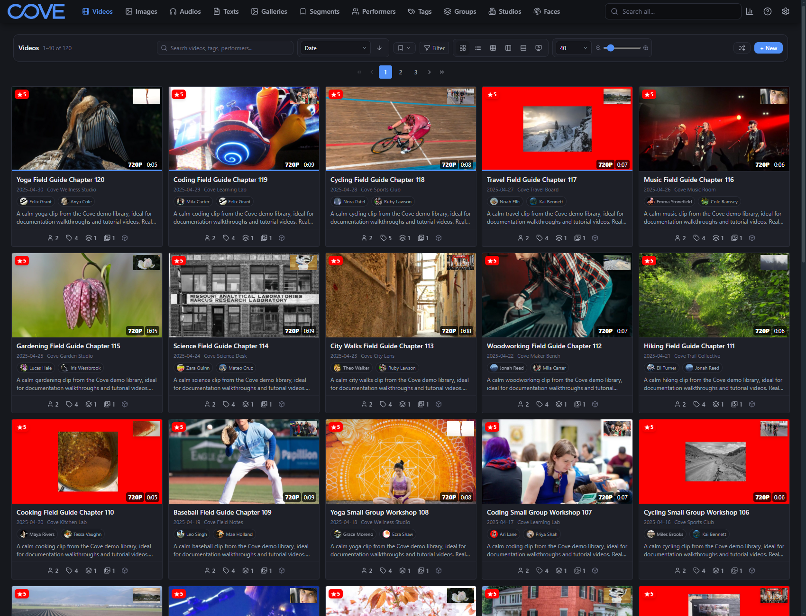
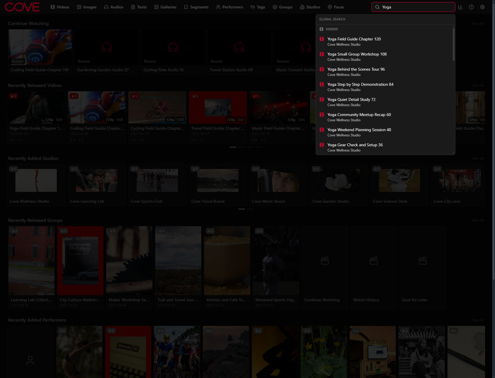
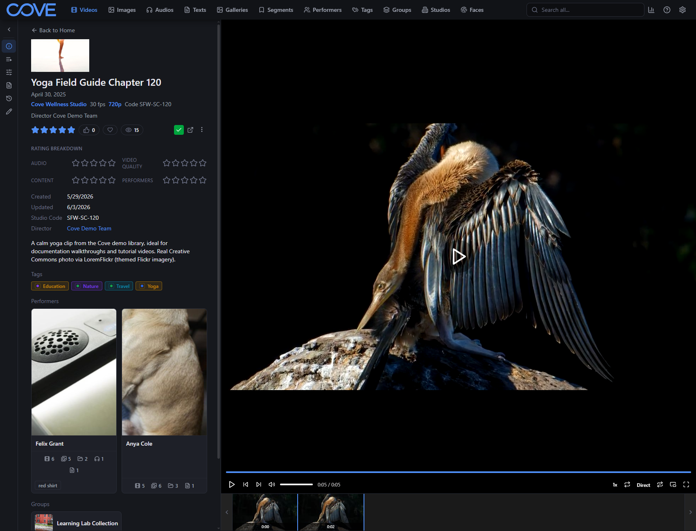
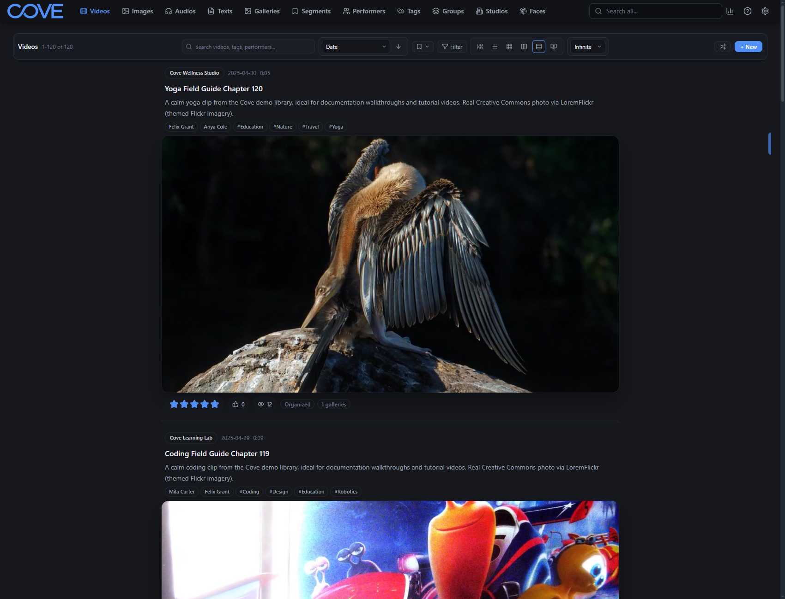
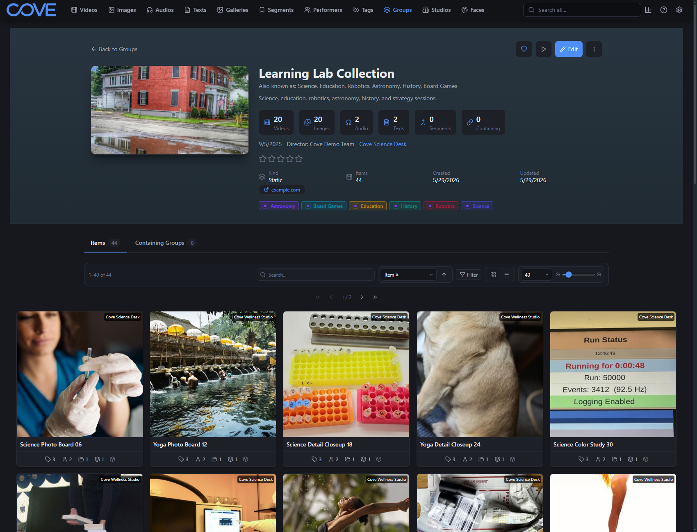
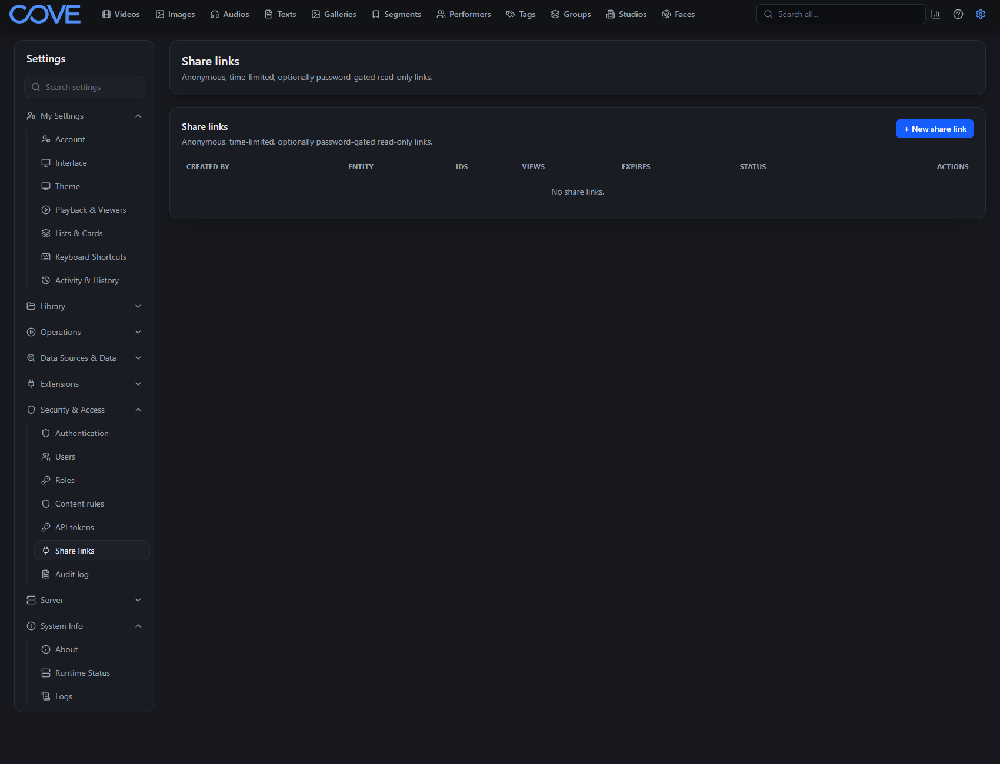
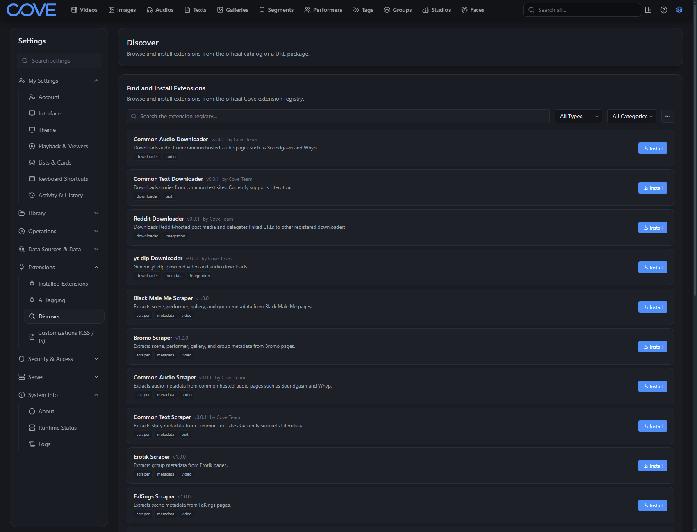
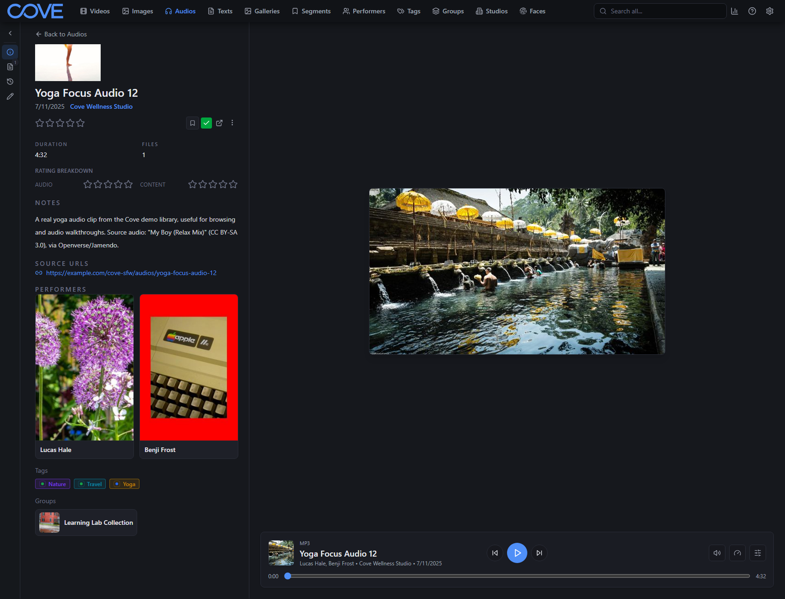

<p align="center">
  
</p>

<h1 align="center">Cove</h1>

<p align="center"><strong>A next-generation media organizer that grows with you.</strong></p>

<p align="center">
  Cove turns your folders of videos, images, galleries, audio, and text into a fast, searchable
  library with safe local network sharing. It's free, open source, and runs
  entirely on your own machine. No account, no cloud.
</p>

<p align="center">
  <a href="https://yourcove.net">Website</a> &middot;
  <a href="https://yourcove.net/docs/">Docs</a> &middot;
  <a href="https://github.com/yourcove/cove/releases/latest">Download</a> &middot;
  <a href="https://discord.gg/MECDFRkzgG">Discord</a> &middot;
  <a href="CONTRIBUTING.md">Contribute</a>
</p>

<p align="center">
  <a href="LICENSE"></a>
  <a href="https://github.com/yourcove/cove/releases/latest"></a>
  <a href="https://discord.gg/MECDFRkzgG"></a>
  <a href="https://github.com/yourcove/cove/stargazers"></a>
</p>

<p align="center">
  
</p>

## Why Cove

- **Not limited to one media type.** Videos, images, galleries, audio, and text live in one library, connected by the performers, studios, tags, groups, and faces behind them.
- **Organizes around real metadata**, not just filenames and folders. Easily acquire metadata from metadata servers or AI extensions.
- **Deep structure inside videos** through segments, sub-videos, and compilations &mdash; no duplicating files on disk.
- **Browse like a library or scroll like a feed**, with grid, list, wall, tagger, feed, and vertical pages for whatever browsing experience you like.
- **Extensions are a core part of the app**, not an afterthought. Cove is designed to be extendable!

## What you can do

<table>
  <tr>
    <td width="62%"></td>
    <td><strong>Find content by whatever you remember or are looking for.</strong><br>Search across everything by title, tag, performer, studio, path, or group. Or add filters to narrow a big library down. Save the searches & filters you like.</td>
  </tr>
  <tr>
    <td></td>
    <td><strong>Tag people, moments, and parts of a video.</strong><br>When a tag only applies to one person or one part of a video, put it exactly there. See who appears in which part of a scene, not just who's in it somewhere.</td>
  </tr>
  <tr>
    <td></td>
    <td><strong>Browse it your way.</strong><br>Grid and list pages for sorting and cleanup; feed and vertical pages for when you just want to watch. Watch later, history, and continue watching let you pick up where you left off.</td>
  </tr>
  <tr>
    <td></td>
    <td><strong>Go beyond flat tagging.</strong><br>Tag groups, dynamic groups that fill themselves based on rules, segments, sub-scenes, and compilations give your library real structure as it grows.</td>
  </tr>
  <tr>
    <td></td>
    <td><strong>Share one library safely.</strong><br>Give each person on your network their own account with roles and permissions that control what they can see and do. Or give someone a share link to specific content.</td>
  </tr>
  <tr>
    <td></td>
    <td><strong>Extend almost anything.</strong><br>Downloaders, scrapers, themes, settings panels, pages, background jobs, API endpoints. If Cove doesn't do something yet, there's a way to add it with extensions.</td>
  </tr>
  <tr>
    <td></td>
    <td><strong>Store all your kinds of content.</strong><br>Store all your types of media in one place: Video, Audio, Galleries, Text files, and the organization surrounding them</td>
  </tr>
</table>

See the [full feature tour](https://yourcove.net/features/) and more [screenshots](https://yourcove.net/screenshots/).

## Get started

**Native app**: download for Windows, macOS, or Linux. The app handles first-run setup, and includes the Cove Instance Manager for running separate local libraries from one place.

- [Latest release](https://github.com/yourcove/cove/releases/latest) &middot; [All releases](https://github.com/yourcove/cove/releases)

**Docker (all-in-one)**: the easiest container setup:

Copy the `docker-compose.allinone.yml` from the docker folder and then simply run:
```bash
docker compose -f docker-compose.allinone.yml up -d
```

Then open `http://localhost:5073`.

Full installation, configuration, and import guides live in the [docs](https://yourcove.net/docs/user/getting-started/install/).

## Support Cove

Cove is built in the open. If you like it and want to help the project, here are the best ways:

- **Star this repo**. It genuinely helps people discover Cove.
- **Join the [Discord](https://discord.gg/MECDFRkzgG)** and tell others about it.
- **Contribute financially** with a one-time or recurring donation on [Open Collective](https://opencollective.com/yourcove).
- **Report Bugs or Request Features** by creating new issues.
- **Build and share extensions, themes, scrapers, and downloaders**. See the [extension template repos](https://github.com/yourcove/single-extension-repo-template).

Want to contribute code? Cove can also **pay contributors** for delivered work. See the [Contribution Guide](CONTRIBUTING.md).

## Documentation

- [User docs](https://yourcove.net/docs/user/): installing, scanning, organizing, sharing.
- [Developer docs](https://yourcove.net/docs/developer/): extensions and the API.
- [Contribution Guide](CONTRIBUTING.md): how to contribute, the AI policy, and how contributors get paid.

## License

Cove is licensed under the [GNU AGPL v3](LICENSE).
